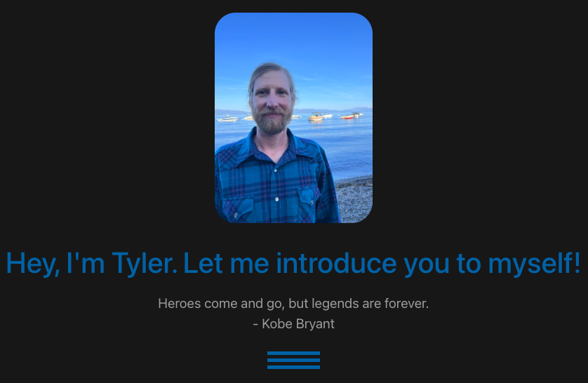

# Mr. Dinslage's Portfolio

## Description

This is a portfolio built to showcase who I am. The application was built on a vue3/vite framework. There is an api built in that brings up a inspriational quote upon visiting. In the header you can click on the different tabs to explore. Multiple pages including my work history & resume, a brief glimpse at who I am, and even a blog page! Tailwind was used to build for css framework. Vue router was also incorporated for smooth transitions between pages.

## Installation

Visit the website to check it out! Nothing to install!

## Acknowledgements

Vue3, Vite, Tailwind, and the Quotes API on RapidAPI. You can find it here:

https://rapidapi.com/martin.svoboda/api/quotes15

## Contact Me

<a href="https://www.linkedin.com/in/tyler-dinslage-profile/" target="_blank">LinkedIN Profile</a>

<a href="https://github.com/tylerdins88?tab=repositories" target="_blank">Github Repo</a>

## Licenses

There is no licenses for this project.
